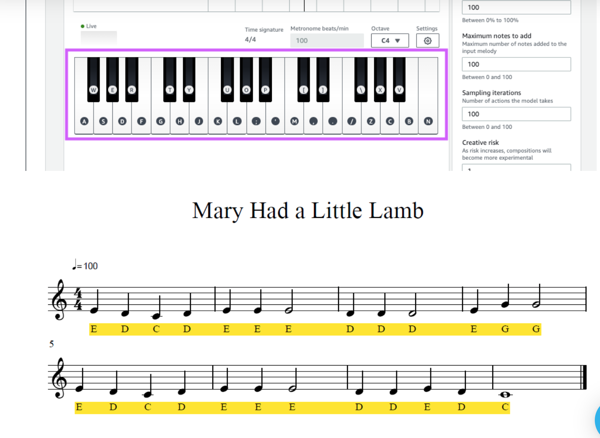

# AWS Machine Learning Foundations 

### Lesson 5: Machine Learning with AWS DeepComposer

### 7. Exercise: Generate an Interface

___

### Prerequisites/Requirements

* **Chrome Browser:** You will need to use the Chrome Browser for this exercise. If you do not have Chrome you can download it here: www.google.com/chrome
* **AWS Account ID:** You will need an AWS Account ID to sign into the console for this project. To set up a new AWS Account ID, follow the directions here: [How do I create and activate a new Amazon Web Services account?](https://aws.amazon.com/premiumsupport/knowledge-center/create-and-activate-aws-account/)

Your AWS account includes free access for up to 500 inference jobs in the 12 months after you first use the AWS DeepComposer service. You can use one of these free instances to complete the exercise at no cost.

You can learn more about DeepComposer costs in the [AWS DeepComposer pricing documentation](https://aws.amazon.com/deepcomposer/pricing/)

### Access AWS DeepComposer console:
[Click on DeepComposer link to get started: ](https://us-east-1.console.aws.amazon.com/deepcomposer)
Enter AWS account ID, IAM Username and Password provided

### Click Sign In

**Note:** You must access the console in N.Virginia (us-east-1) AWS region You can use the dropdown to select the correct region.

1. Click Music Studio from the left navigation menu
2. Choose an Input Melody
3. Click play to play the default input melody
4. Select Generative Adversarial Networks as the Generative AI technique.
5. Select MuseGAN as the Generative Algorithm.
6. Select a Model.
7. Click Generate composition to generate a composition and an AI generated composition will be created.
8. Click play to play the new AI generated musical composition.

### Input melody:
1. To create a custom melody, click record to start recording
2. and play the notes on the keyboard.

3. Click the stop button to stop recording when you are done.
4. Play the recorded music to verify the input. In case you don’t like recorded music, you may start recording again by clicking record
5. Select Generative Adversarial Networks as the Generative AI technique.
6. Select MuseGAN as the Generative Algorithm
7. Select a Model.
8. Click Generate composition to generate a composition and an AI generated composition will be created.
9. Click play to play the composition and enjoy the AI generated music.
10. Try experimenting with different genres or sample input melody.

Congratulations! You have learned how to use pre-trained models to generate new music!