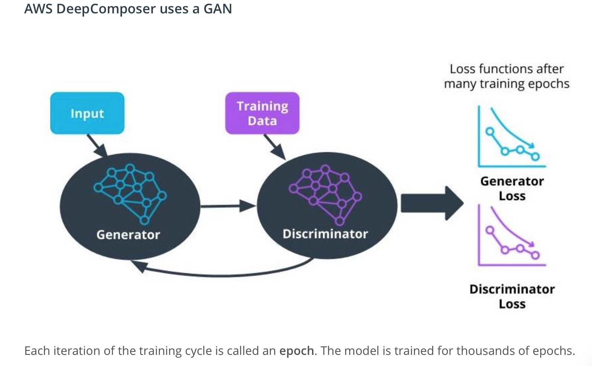
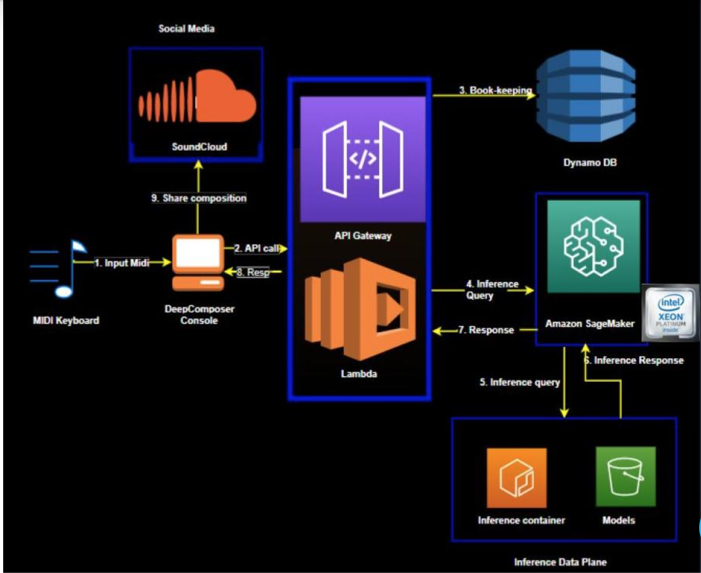

# AWS Machine Learning Foundations 

### Lesson 5: Machine Learning with AWS DeepComposer

### 8. How DeepComposer Works

___

### Model Training with AWS DeepComposer

Each iteration of the training cycle is called an epoch. The model is trained for thousands of epochs.

### Loss Functions
In machine learning, the goal of iterating and completing epochs is to improve the output or prediction of the model. Any output that deviates from the ground truth is referred to as an error. The measure of an error, given a set of weights, is called a loss function. Weights represent how important an associated feature is to determining the accuracy of a prediction, and loss functions are used to update the weights after every iteration. Ideally, as the weights update, the model improves making less and less errors. Convergence happens once the loss functions stabilize.

We use loss functions to measure how closely the output from the GAN models match the desired outcome. Or, in the case of DeepComposer, how well does DeepComposer's output music match the training music. Once the loss functions from the Generator and Discriminator converges, this indicates the GAN model is no longer learning, and we can stop its training.

We also measures the quality of the music generated by DeepComposer via additional quantitative metrics, such as drum pattern and polyphonic rate.

GAN loss functions have many fluctuations early on due to the “adversarial” nature of the generator and discriminator.

Over time, the loss functions stabilizes to a point, we call this convergence. This convergence can be zero, but doesn’t have to be.

### How It Works
1. Input melody captured on the AWS DeepComposer console
2. Console makes a backend call to AWS DeepComposer APIs that triggers an execution Lambda.
3. Book-keeping is recorded in Dynamo DB.
4. The execution Lambda performs an inference query to SageMaker which hosts the model and the training inference container.
5. The query is run on the Generative AI model.
6. The model generates a composition.
7. The generated composition is returned.
8. The user can hear the composition in the console.
9. The user can share the composition to SoundCloud.