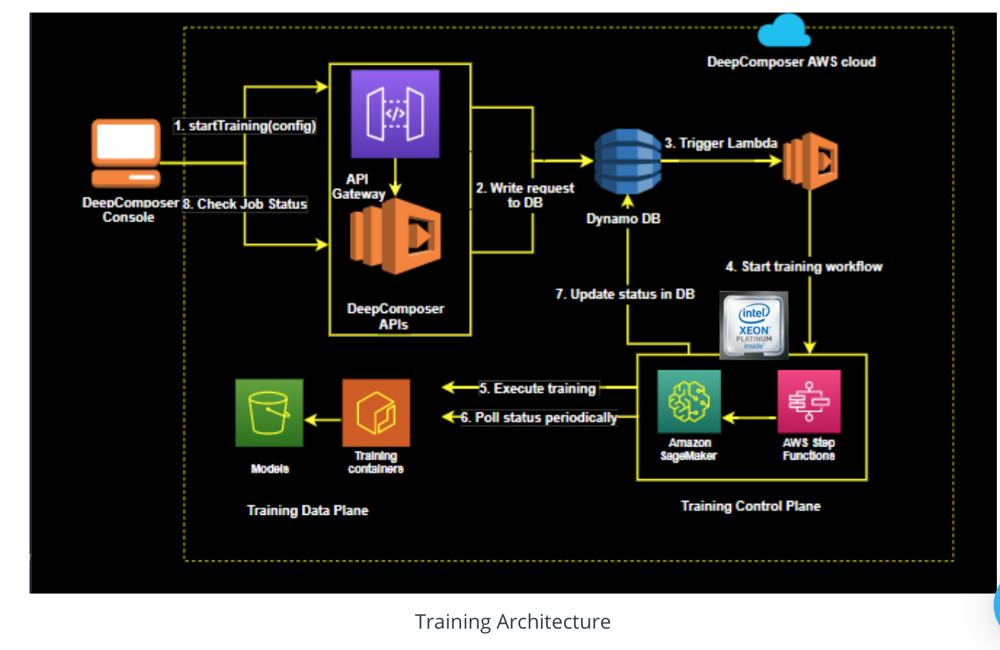

# AWS Machine Learning Foundations 

### Lesson 5: Machine Learning with AWS DeepComposer

### 9. Training Architecture 

___

[video](https://www.youtube.com/watch?v=cUYYsxNHYbQ&feature=emb_logo)

### How to measure the quality of the music we’re generating:

1. We can monitor the loss function to make sure the model is converging
2. We can check the similarity index to see how close is the model to mimicking the style of the data. When the graph of the similarity index smoothes out and becomes less spikey, we can be confident that the model is converging
3. We can listen to the music created by the generated model to see if it's doing a good job. The musical quality of the model should improve as the number of training epochs increases.

### Training architecture

1. User launch a training job from the AWS DeepComposer console by selecting hyperparameters and data set filtering tags
2. The backend consists of an API Layer (API gateway and lambda) write request to DynamoDB
3. Triggers a lambda function that starts the training workflow
4. It then uses AWS Step Funcitons to launch the training job on Amazon SageMaker
5. Status is continually monitored and updated to DynamoDB
6. The console continues to poll the backend for the status of the training job and update the results live so users can see how the model is learning

### Challenges with GANs
1. Clean datasets are hard to obtain
2. Not all melodies sound good in all genres
3. Convergence in GAN is tricky – it can be fleeting rather than being a stable state
4. Complexity in defining meaningful quantitive metrics to measure the quality of music created

